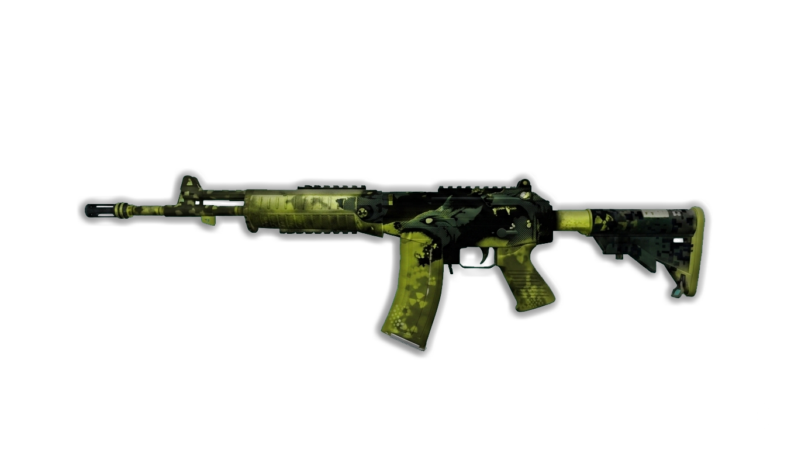

# CS-Vertex
<!DOCTYPE html>
<html lang="es">
<head>
    <meta charset="UTF-8">
    <meta name="viewport" content="width=device-width, initial-scale=1.0">
    <title>CS2 Skin Hub | Elite Selection</title>
    <link href="https://fonts.googleapis.com/css2?family=Rajdhani:wght@600;700&display=swap" rel="stylesheet">
    
</head>
<body>

    

        
        <!-- MENÚ ACTUALIZADO[cite: 2] -->
        <header>
            <nav class="nav-container">
                <a href="#" class="active">Skins Armas</a>
                <a href="#">Modelos Personajes</a>
                <a href="#">Servidores</a>
                <a href="#">Comunidad</a>
            </nav>
        </header>

        <main class="main-content">
            
            <!-- TARJETA DE LA GALIL CON TU LINK[cite: 1, 2] -->
            

                Rifle de Asalto
                
                

                    <!-- Asegúrate de que galil.png esté en la carpeta 'img'[cite: 1, 2] -->
                    
                

                

                    <h3 class="skin-title">Galil AR | Custom</h3>
                    
Archivo: v_galil.mdl   Calidad: Recién Fabricado

                

                <!-- TU ENLACE DE MEDIAFIRE INTEGRADO[cite: 1, 2] -->
                <a href="https://www.mediafire.com/file/01wux4gtbw5ddhu/v_galil.mdl/file" 
                   target="_blank" 
                   class="btn-mediafire">
                    Descargar de Mediafire
                </a>
            

        </main>

    

</body>
</html>
